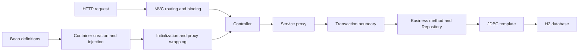

# Spring from Scratch — Series Guide

[中文](../../tutorial/00-导读与学习路线.md) · [Series contents](../README.md)

Build the core of a framework yourself, from IoC to MVC, AOP and transactions.

This series is for readers who know Java basics and want to understand how frameworks work internally. Starting with a small object container, we implement dependency injection, lifecycle management, MVC dispatch, a JDBC template, dynamic proxies and transactions. Finally, we connect them into an application that receives HTTP requests and accesses a real database.

All implementation code is printed in the articles. Each technical chapter includes complete classes, interfaces, annotations, helpers, business examples and a main method. Reading and running a chapter requires neither a companion Java file nor another framework source repository.

## Work through each chapter

Use JDK 17. In Chapter 1, save the entire “Complete code” block as `Demo01.java`, then run these commands in that directory:

```bash
javac --release 17 Demo01.java
java Demo01
```

Chapter 2 uses `Demo02.java`, and so on. Each chapter provides its own commands and expected output. The check helper throws AssertionError when a condition fails; it needs neither a testing library nor the `-ea` flag.

Each stage uses a different outer class name, with related types as static nested classes. You can keep several stages in one directory while compiling any chapter independently. Later chapters repeat the container or template code they still need to remain self-contained. First locate the new part, then compare it with earlier versions.

Chapters 11, 12, 16 and 17 need the H2 driver to run actual SQL. This is a database runtime dependency, not an external implementation of our framework. Those chapters include pinned download and execution commands. Other chapters use only the JDK standard library. XML and test data are embedded in the code.

## Learning path

| Stage | Chapters | Questions answered |
| --- | --- | --- |
| Object creation | 01–03 | How definitions become objects and dependencies reach constructors and properties |
| Container organization | 04–07 | Circular dependencies, lifecycle, annotations, contexts and events |
| Request handling | 08–10 | How requests select methods, bind arguments and represent results |
| Data access | 11–12 | How to encapsulate JDBC and execute SQL from XML mappings |
| Method enhancement | 13–15 | How proxies compose advice and how the container creates them automatically |
| Transaction integration | 16–17 | How method boundaries share database connections and how to verify rollback |

The main relationships are:



## Do more than check successful execution

Consider at least one failure condition in each chapter. What happens when a bean definition is absent? Are two dependency candidates ambiguous? Does invalid input return 400? Does a target exception really cause database rollback?

Finding an object by name or type is only part of assembly. Also check whether the exposed object is raw or proxied, which layer closes each resource, and whether failed creation leaves stale cache entries.

After running an example unchanged, deliberately break one rule, observe the assertion or exception, then restore it. Remove a singleton-cache write, alter a constructor parameter type, skip proceed in an interceptor, or make the template bypass the transaction connection. Explaining the resulting failure matters more than memorizing class names.

## Implementation boundaries

The container starts on one thread. The main container rejects dependency cycles; Chapter 4 separately demonstrates setter cycles without proxies and is not merged into automatic proxying. Do not mutate definitions after startup.

MVC begins with transport-independent Request and Response objects. Chapter 17 adds JDK HttpServer. It is not a Servlet container and does not include general JSON request bodies, JSP or component scanning. Request parameters use explicit name-binding rules.

SQL mapping supports simple select, update and named parameters. Transactions cover one level of local transaction on the current thread and reject nesting. FactoryBean product caching, proxy cycles, multiple data sources and complex propagation remain extension topics.

The aim is to write the core control flow yourself and understand what each part guarantees. The final chapter uses HTTP requests and database values to verify successful updates and failed-update rollback.

Next: [Build Your First Bean Container](01-first-bean-container.md).
