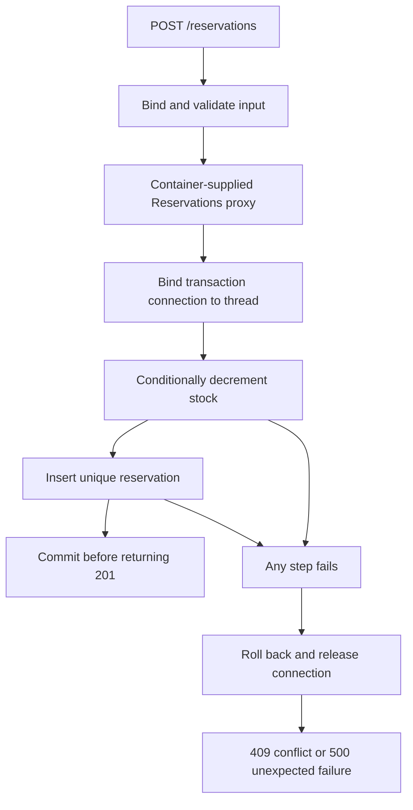

# Start with Reservations: Series Guide

[中文](../../tutorial/00-从图书预约出发.md) · [Series contents](../README.md)

Begin with a testable rule: with two copies, one successful reservation must leave one available copy and add one record. Failure must change neither. This rule runs through the whole series.

## Run the business before extracting the framework

| Milestone | Chapters | Why the next capability is needed |
| --- | --- | --- |
| A correct reservation | 01–02 | After single-threaded rules, test two readers competing for the last copy |
| A clear entry point | 03–04 | Map business outcomes to stable responses and validate strings before writes |
| An atomic write | 05–07 | Two SQL statements can partially succeed; establish transaction and connection ownership |
| A shared business boundary | 08–09 | Callers can forget wrappers; audit success must follow commit |
| Inspectable assembly | 10–13 | Centralize creation, dependency diagnosis, resource cleanup and exposed proxy identity |
| Declarations and acceptance | 14–17 | Turn routing and dependencies into metadata, then verify through real requests |

Each stage starts with the business consequence of a failure and introduces the smallest component that satisfies its contract. Naming a pattern is not the goal: extracting it must preserve behavior.

## Run each chapter

Use JDK 17. Save the complete listing as its DemoNN.java and follow that chapter's commands. Required types are printed again, so no earlier file is needed. Key comments explain lock scope, cached identity and resource ownership.

Chapters 05–11, 13 and 15–17 use H2 2.2.224. It provides a database engine, not our template, transaction runner or container. JDBC, XML, reflection, executors and HttpServer come from the JDK. Chapter 17's default acceptance checks open and close a temporary loopback listener.

Chapter 5 deliberately demonstrates a partial commit. Later stages repair it. Matching the printed output does not mean every intermediate version is suitable for deployment.

## The final reservation path

Each arrow represents a direct code call, not a queue or distributed service. Duplicate tests must query post-rollback state. Race tests must count successful outcomes rather than just inspect logs.

## Reading and extending

Run each listing unchanged, then perform its failure experiment. Change call placement, connection ownership, advice order or cached identity and explain which invariant breaks.

The [example application](../../examples/library/README.md) provides conventional packages for IDE navigation. It and the standalone article programs are checked independently; success in one form is not evidence that the other still works.

Next: [Start with Executable Reservation Rules](01-reservation-rules.md).
