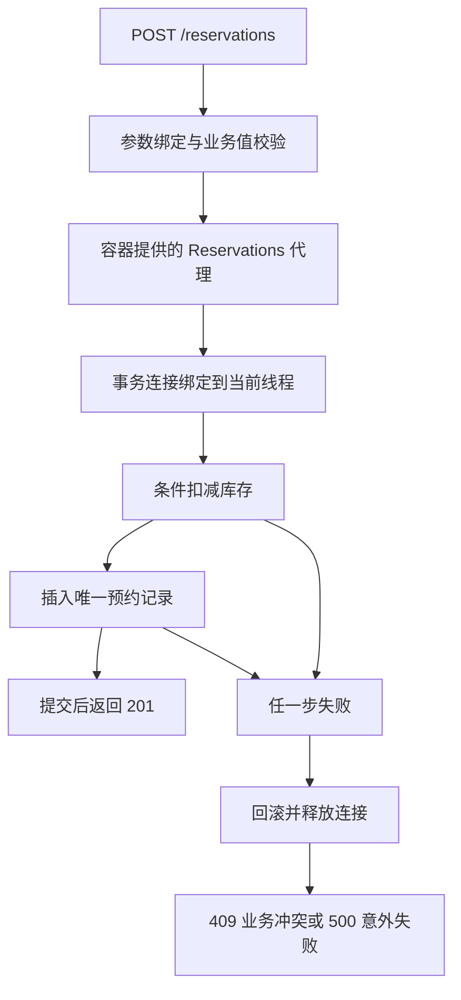

# 从图书预约出发的学习路线

[English](../en/tutorial/00-start-with-reservations.md) · [系列目录](../README.md)

先提出一个可验证的问题：图书有两本，成功预约一次后必须剩一本且增加一条记录；失败时二者都不能改变。这个约束将贯穿全部章节。

## 先运行业务，再抽取框架

| 里程碑 | 篇章 | 为什么需要下一项能力 |
| --- | --- | --- |
| 一次正确的预约 | 01–02 | 单线程规则成立之后，要验证两个读者竞争最后一本 |
| 一个明确的入口 | 03–04 | 业务错误要映射为稳定响应，字符串必须先校验再写入 |
| 一次原子的写入 | 05–07 | 两次 SQL 会部分成功，需要事务和明确的连接所有权 |
| 一个统一的业务边界 | 08–09 | 调用方会漏写事务包装，审计成功必须发生在提交之后 |
| 一处可检查的装配 | 10–13 | 多入口重复创建、依赖诊断、资源清理与代理身份需要统一管理 |
| 一套声明与验收流程 | 14–17 | 路由和依赖变成元数据，再用真实请求验收完整业务链 |

每一阶段先说明失败会造成什么业务后果，再实现满足当前约定的最小部件。名字不是目标：只有行为仍然成立，抽取才是成功的。

## 如何运行每篇

准备 JDK 17。把正文完整代码保存为对应 DemoNN.java，在该目录按文中命令编译。每篇重新列出仍需使用的类型，因此不依赖前一篇文件。关键注释解释锁的范围、缓存身份与资源归属。

第 05–11、13、15–17 篇需要 H2 2.2.224。它提供数据库引擎，不提供我们手写的模板、事务或容器。JDBC、XML、反射、线程池与 HttpServer 都来自 JDK。第 17 篇默认验收会监听本机临时端口，完成后关闭。

第 05 篇是刻意保留的失败反例，输出部分提交的状态；从第 06 篇开始逐步修复。不要把“预期输出匹配”误解为每个中间版本都适合正式使用。

## 最终预约调用链

图中的每个箭头都对应代码中的调用，不代表消息队列或分布式服务。重复预约必须检查回滚后的数据库值，竞争测试必须检查成功数量，不能只看日志。

## 阅读与扩展原则

先运行不改动的程序，再执行每篇末尾的故障实验。不要只改类名：尝试改变调用位置、连接来源、增强顺序或缓存对象，说明哪条业务约束因此失效。

正文保留每阶段完整程序；[示例项目](../examples/library/README.zh.md)则提供常规包结构，便于在 IDE 中跟踪调用。两种形态都需要独立验证，不能用其中一个通过来代替另一个。

下一篇：[先把预约规则写成可执行程序](01-先把预约规则写成可执行程序.md)。
