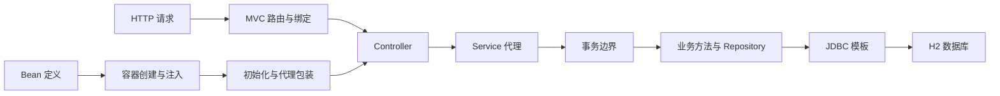

# 一步步手写 Spring 系列导读

[English](../en/tutorial/00-guide.md)

从 IoC 到 MVC、AOP 与事务，亲手实现框架核心。

这套教程面向已经掌握 Java 基础、希望弄清框架内部怎样工作的读者。我们从一个最小的对象容器开始，逐步实现依赖注入、生命周期、MVC 分发、JDBC 模板、动态代理与事务，最后把它们接成一个可以接收 HTTP 请求、访问真实数据库的小应用。

所有实现代码都直接写在文章里。每篇正文都包含完整的类、接口、注解、工具方法、业务示例和 main 方法；阅读与运行不需要跳转到配套 Java 文件，也不需要下载另一份框架源码。

## 每篇如何动手

使用 JDK 17。进入第一篇，把“完整代码”中的整段内容保存为 `Demo01.java`，然后在文件所在目录执行：

```bash
javac --release 17 Demo01.java
java Demo01
```

第二篇对应 `Demo02.java`，以此类推。每篇都给出自己的编译命令和预期输出，代码中的 check 方法在条件不成立时抛出 AssertionError，不依赖额外测试框架，也不要求添加 `-ea`。

各篇使用不同的外层类名，相关类放在其中作为静态内部类。这样既能在同一目录保存多个阶段，又能保证任意一篇可以独立编译。为了让代码自包含，后续篇章会完整保留仍然需要的容器或模板代码；你可以先定位本篇新增的部分，再对照前面的版本观察变化。

第 11、12、16、17 篇需要 H2 驱动来运行真实 SQL。驱动是数据库运行依赖，不是教程框架代码；这几篇都给出了固定版本的下载与运行命令。其他篇章仅使用 JDK 标准库。XML 和测试数据直接写在代码中，无需另外准备文件。

## 学习路线

| 阶段 | 篇章 | 解决的问题 |
| --- | --- | --- |
| 对象创建 | 01 至 03 | 定义如何转成对象，依赖如何进入构造器和属性 |
| 容器组织 | 04 至 07 | 循环依赖、生命周期、注解、上下文与事件 |
| 请求处理 | 08 至 10 | 请求怎样找到方法，参数如何绑定，结果怎样表示 |
| 数据访问 | 11 至 12 | 如何封装 JDBC，并让 XML 映射驱动 SQL 执行 |
| 方法增强 | 13 至 15 | 动态代理如何组合增强，怎样由容器自动创建 |
| 事务整合 | 16 至 17 | 方法边界怎样与数据库连接协作，怎样验证回滚 |

框架中的主要关系如下：



## 不要只看运行成功

每一篇都需要关注至少一个失败条件。例如没有 Bean 定义应该报什么错误，两个依赖候选者是否有歧义，非法参数是否返回 400，目标对象抛错后事务是否真正回滚。

按名称或类型找到对象，只完成了装配的一部分。后续还要关注最终拿到的是原始对象还是代理，关闭资源的到底是哪一层，以及创建失败时缓存里有没有残留。

建议每读完一篇，先运行原始代码，再故意破坏一条规则，观察断言或异常，然后恢复。例如删除单例缓存写入、改变构造器声明类型、让拦截器不调用 proceed、让模板绕开事务连接。能够解释失败原因，比仅记住类名更有价值。

## 当前实现边界

容器采用单线程启动。主容器拒绝依赖环，第四篇单独演示无代理的 Setter 循环；它没有被直接合并进自动代理容器。对象定义在启动完成后不应继续修改。

MVC 从传输无关的 Request 和 Response 开始，第十七篇提供 JDK HttpServer 入口。它不是 Servlet 容器，不包含通用 JSON 请求体、JSP 或组件扫描。请求参数采用明确的名称绑定规则。

SQL 映射支持简单的 select、update 和命名参数。事务只覆盖当前线程的一层本地事务，嵌套调用明确拒绝。FactoryBean 产品缓存、代理循环依赖、多数据源和复杂事务传播属于后续扩展方向。

这套教程的目标是让你能亲手写出核心流程，并知道每段代码保证了什么。最终综合篇会用实际 HTTP 请求和数据库值检查成功更新与失败回滚。

下一篇：[实现第一个 Bean 容器](01-实现第一个Bean容器.md)。
